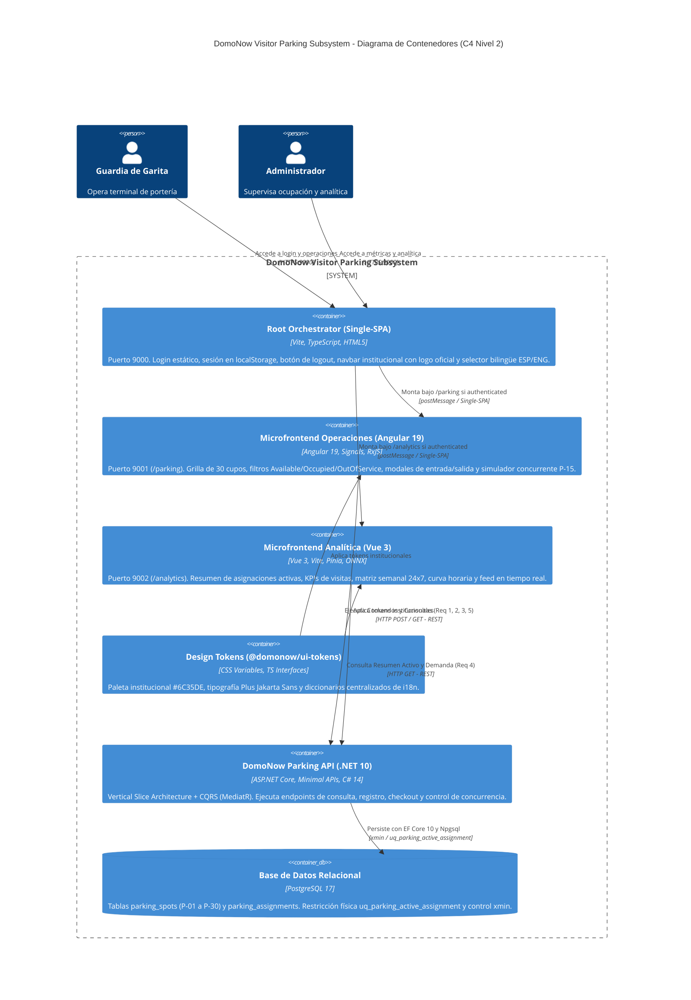
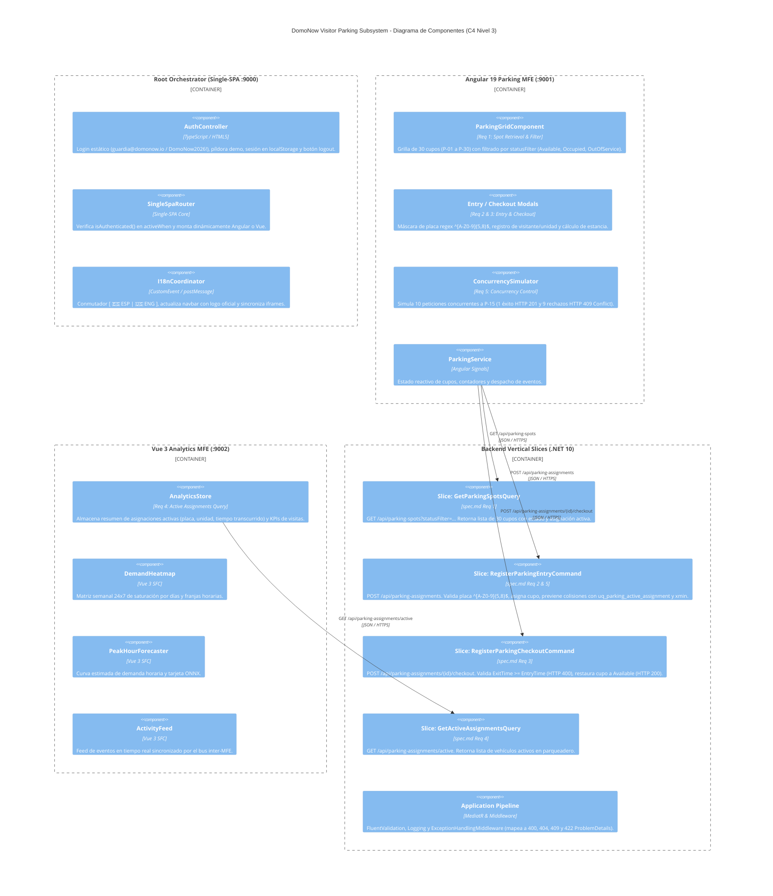

# Documentación Técnica de Arquitectura: DomoNow Visitor Parking Subsystem

Este documento define la arquitectura técnica formal de **DomoNow**, estructurada según el **Modelo C4** (Contexto, Contenedores y Componentes), delimitada **estrictamente a los requerimientos y reglas de negocio especificados en [openspec/specs/visitor-parking/spec.md](file:///Users/deals/Documents/GIT/DOMONOW-TEST/collection-domonow/openspec/specs/visitor-parking/spec.md)** y las implementaciones activas en las UIs y backend.

---

## 1. Trazabilidad de Requerimientos y Reglas de Negocio (`spec.md`)

Toda la arquitectura implementada y diagramada responde de forma unívoca a los 5 requerimientos normativos del subsistema:

| Identificador | Requerimiento Normativo | Endpoint / Caso de Uso | Reglas de Negocio / Invariantes Soportadas |
| :--- | :--- | :--- | :--- |
| **Req 1** | **Consulta y Filtrado de Cupos** | `GET /api/parking-spots?statusFilter=...` | • Retorna los 30 cupos configurados (`P-01` a `P-30`). • Filtro opcional por estado (`Available`, `Occupied`, `OutOfService`). • Si está ocupado, incluye detalle de la asignación activa. |
| **Req 2** | **Registro de Ingreso de Visitantes** | `POST /api/parking-assignments` | • Asigna cupo disponible, registra nombre de visitante y unidad de destino. • Sanitiza y valida placa vehicular con formato estricto `^[A-Z0-9]{5,8}$` (HTTP 422 si es inválida). • Registra fecha de ingreso en UTC y transiciona cupo a `Occupied` (HTTP 201). • Si el cupo ya está ocupado, rechaza con **HTTP 409 Conflict**. • Si el cupo está `OutOfService`, rechaza con **HTTP 422 Unprocessable Entity**. |
| **Req 3** | **Salida y Reversión de Cupo (Checkout)** | `POST /api/parking-assignments/{id}/checkout` | • Registra `exitTimeUtc` y marca asignación como `Completed`. • **Regla de Invariante Temporal:** Verifica que `ExitTime >= EntryTime` (HTTP 400 Bad Request si la fecha de salida precede a la entrada). • Retorna HTTP 200 OK con los minutos de estancia calculados. • Restaura automáticamente el cupo asociado a estado `Available`. • Si la asignación no existe, retorna **HTTP 404 Not Found**. |
| **Req 4** | **Resumen de Asignaciones Activas** | `GET /api/parking-assignments/active` | • Expone lista en tiempo real de vehículos actualmente estacionados. • Retorna número de bahía, placa, visitante, unidad y tiempo transcurrido para el operador. |
| **Req 5** | **Control de Alta Concurrencia** | `ConcurrencyRaceControl` | • Garantía transaccional: Ante 10 solicitudes HTTP concurrentes sobre el cupo `P-15`, **exactamente 1 tiene éxito (HTTP 201 Created)** y **exactamente 9 son rechazadas con HTTP 409 Conflict**. • La base de datos mantiene exactamente una sola fila activa gracias a la restricción física `uq_parking_active_assignment`. |

---

## 2. Justificación Arquitectónica en Lenguaje Natural

### 2.1 ¿Por qué Microfrontends en el Frontend? (Single-SPA, Angular 19 y Vue 3)

La solución de frontend no es un monolito acoplado, sino un ecosistema modular orquestado por **Single-SPA** que responde a las necesidades reales de los dos perfiles del sistema:

1. **Root Orchestrator (Vite + Single-SPA Core, Puerto 9000):**
   * **Propósito:** Actúa como contenedor institucional central.
   * **Funcionalidad Implementada:** Pantalla inicial de Login con credenciales estáticas (`guardia@domonow.io` / `DomoNow2026!`), botón de cierre de sesión (`#btn-logout`), persistencia de sesión en `localStorage ('domonow_auth_user')`, selector reactivo bilingüe `[ 🇪🇸 ESP | 🇺🇸 ENG ]` y carga del logo oficial `domonow-logo-320.webp`.
   * **Justificación:** Mantiene la autenticación y la navegación institucional desacoplada de los frameworks hijos, gestionando el ciclo de vida condicional (`activeWhen` solo si está autenticado).
2. **Microfrontend de Operaciones de Garita (Angular 19, Puerto 9001 - `/parking`):**
   * **Propósito:** Tablero de control operativo en tiempo real para el guardia.
   * **Funcionalidad Implementada:** Renderizado de la grilla de 30 cupos (`P-01` a `P-30`), filtros de estado (**Req 1**), modal de ingreso con máscara de placa y validaciones (**Req 2**), modal de checkout (**Req 3**) y simulador de ráfaga concurrente anti-carreras (**Req 5**).
   * **Justificación:** Angular 19 con **Angular Signals** garantiza un control de estados determinista, tipado estricto en formularios reactivos y prevención de fugas de memoria en la garita.
3. **Microfrontend de Analítica y Monitoreo (Vue 3, Puerto 9002 - `/analytics`):**
   * **Propósito:** Panel de supervisión analítica para el administrador de la copropiedad.
   * **Funcionalidad Implementada:** Monitoreo del resumen de asignaciones activas (**Req 4**), KPIs de visitas registradas hoy y tiempo promedio de estadía, matriz de calor semanal 24x7 (Heatmap), curva de demanda horaria y feed de actividad en vivo conectado al bus inter-MFE.
   * **Justificación:** Vue 3 y Pinia proporcionan un Virtual DOM altamente reactivo y liviano, ideal para matrices de datos densas sin penalizar la velocidad de la máquina de garita.
4. **Librería de Tokens Compartidos (`@domonow/ui-tokens`):**
   * Centraliza los tokens CSS (`#6C35DE`, tipografía *Plus Jakarta Sans*) y los diccionarios i18n para asegurar coherencia visual en todos los subproyectos.

---

### 2.2 ¿Por qué CQRS en el Backend?

El subsistema presenta una separación clara entre operaciones de escritura y de lectura:
* **Escrituras (Comandos - Req 2, Req 3 y Req 5):** Operaciones transaccionales que alteran el estado del estacionamiento. Exigen validación de invariantes, serialización y control de concurrencia optimista (`RowVersion` mapeado a `xmin` en PostgreSQL).
* **Lecturas (Consultas - Req 1 y Req 4):** Consultas de alta frecuencia para refrescar el estado de los cupos y alimentar el tablero del operador sin necesidad de tracking de entidades ni bloqueos de lectura.

**Beneficio:** Elimina la contención entre las consultas de los tableros y las transacciones de ingreso vehicular en la talanquera.

---

### 2.3 ¿Por qué Vertical Slice Architecture?

En lugar de capas horizontales tradicionales (*Controllers -> Services -> Repositories -> Entities*), el backend organiza el código por **casos de uso autónomos**:
* `GetParkingSpotsSlice` (Req 1)
* `RegisterParkingEntrySlice` (Req 2 y Req 5)
* `RegisterParkingCheckoutSlice` (Req 3)
* `GetActiveAssignmentsSlice` (Req 4)

**Beneficio:** Cada rebanada contiene su propio endpoint, comando/query, validador FluentValidation y handler. Si se modifica la regla temporal del checkout, el radio de impacto sobre el registro de ingreso es exactamente cero (*Blast Radius = 0*).

---

## 3. Diagramas de Arquitectura C4

Archivos Draw.io nativos disponibles en el repositorio:
* 📊 Archivo Maestro Multi-Pestaña: [c4-architecture.drawio](file:///Users/deals/Documents/GIT/DOMONOW-TEST/collection-domonow/docs/architecture/c4-architecture.drawio)
* 🌐 Diagrama de Contexto (Nivel 1): [c4-context.drawio](file:///Users/deals/Documents/GIT/DOMONOW-TEST/collection-domonow/docs/architecture/c4-context.drawio)
* 📦 Diagrama de Contenedores (Nivel 2): [c4-containers.drawio](file:///Users/deals/Documents/GIT/DOMONOW-TEST/collection-domonow/docs/architecture/c4-containers.drawio)
* 🧩 Diagrama de Componentes (Nivel 3): [c4-components.drawio](file:///Users/deals/Documents/GIT/DOMONOW-TEST/collection-domonow/docs/architecture/c4-components.drawio)

---

### 3.1 C4 - Nivel 1: Diagrama de Contexto del Sistema

Delimitado a los dos actores humanos soportados en la especificación y en las UIs:

---

### 3.2 C4 - Nivel 2: Diagrama de Contenedores

Representa los contenedores ejecutables que componen la solución implementada:

---

### 3.3 C4 - Nivel 3: Diagrama de Componentes

Muestra el detalle interno de los componentes de Frontend y la correspondencia 1:1 de los Vertical Slices con la especificación `spec.md`:

---

## 4. Guía de Uso de los Archivos Draw.io

Los diagramas C4 están disponibles en formato XML nativo para **Draw.io (Diagrams.net)**:
1. **En la Web:** Puedes abrir [https://app.diagrams.net](https://app.diagrams.net) y seleccionar `Open Existing Diagram` -> [c4-architecture.drawio](file:///Users/deals/Documents/GIT/DOMONOW-TEST/collection-domonow/docs/architecture/c4-architecture.drawio).
2. **En VS Code:** Con la extensión `hediet.vscode-drawio`, haz clic sobre cualquiera de los archivos `.drawio` para editarlos interactivamente.
