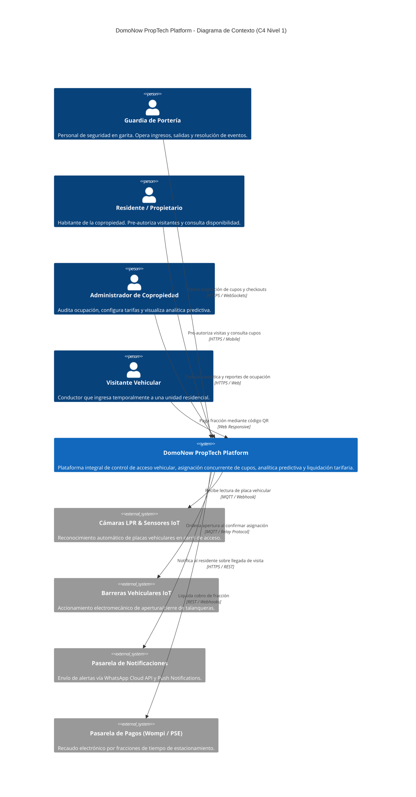
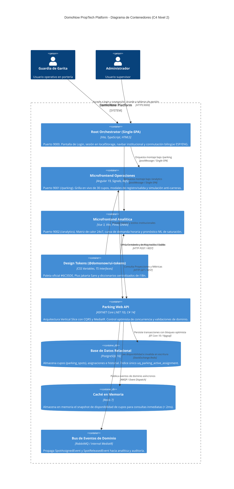
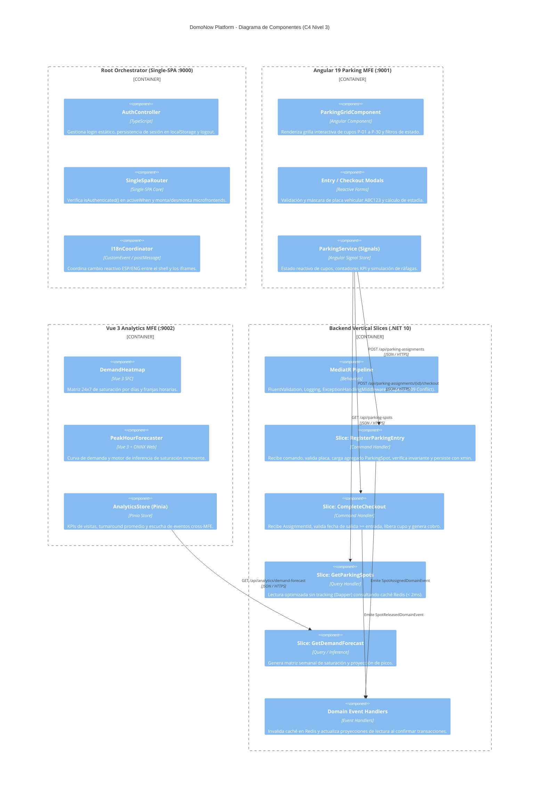

# Documentación Técnica de Arquitectura: DomoNow PropTech Platform

Este documento define la arquitectura técnica formal de **DomoNow**, estructurada según el **Modelo C4** (Contexto, Contenedores y Componentes), acompañada de la justificación técnica en lenguaje natural sobre las decisiones fundamentales de diseño de software: la adopción de **Microfrontends (Single-SPA)** en la capa de presentación y **CQRS con Vertical Slice Architecture** en el backend.

---

## 1. Justificación Arquitectónica en Lenguaje Natural

### 1.1 ¿Por qué Microfrontends en el Frontend? (Single-SPA, Angular 19 y Vue 3)

Tradicionalmente, las aplicaciones web se conciben como monolitos en el frontend. Si bien esto simplifica las etapas iniciales de desarrollo, genera graves problemas a medida que la plataforma escala: dependencias acopladas, despliegues "todo o nada", lentitud en la compilación y la imposibilidad de utilizar la herramienta óptima para cada caso de uso.

En **DomoNow**, la interfaz de usuario se dividió en microfrontends orquestados por **Single-SPA**:

```
                         [ Single-SPA Root Orchestrator ] (Puerto 9000)
                                        │
           ┌────────────────────────────┴────────────────────────────┐
           ▼                                                         ▼
[ Angular 19 Parking MFE ] (:9001)                         [ Vue 3 Analytics MFE ] (:9002)
  - Operaciones Críticas de Portería                         - Analítica Predictiva & Machine Learning
  - Formularios Reactivos & Tipado Estricto                  - Matriz de Calor 24x7 y Visualización Reactiva
  - Máquina de Estados & Prevención de Carreras              - Motor de Inferencia ONNX Runtime Web
```

#### Razones Clave de la Elección:
1. **Autonomía y Despliegue Desacoplado:**
   * El equipo encargado de la operativa en garita (asignación de cupos y cobro) puede actualizar, probar y desplegar el microfrontend de Angular sin reiniciar ni poner en riesgo la disponibilidad del módulo analítico o la pantalla de login institucional.
2. **Selección Tecnológica Adecuada al Problema (*Polyglot Frontend*):**
   * **Root Orchestrator (Vite + Single-SPA Core):** Un contenedor ultraligero y agnóstico que gestiona la autenticación inicial (Login estático RBAC), el navbar institucional superior, el estado de sesión y la coordinación bilingüe (ESP/ENG), sin la sobrecarga de un framework pesado en la raíz.
   * **Angular 19 (Operaciones de Garita):** Seleccionado para la operativa en vivo debido a su robustez empresarial, su sistema de tipos estricto y la nueva arquitectura reactiva de **Angular Signals**. Permite modelar la grilla de parqueaderos (P-01 a P-30), los estados transaccionales (Disponible, Ocupado, Fuera de Servicio) y la simulación de ráfagas concurrentes con predictibilidad matemática y cero fugas de memoria.
   * **Vue 3 (Analítica y Demanda Predictiva):** Seleccionado para la inteligencia de negocio por su reactividad fluida, ligereza y rendimiento superior al renderizar matrices densas (como el Heatmap semanal 24x7) y gráficos de tendencias horarias. Además, facilita la integración transparente de librerías de inferencia como ONNX Runtime Web sin penalizar la interfaz de garita.
3. **Resiliencia y Tolerancia a Fallos (*Fault Isolation*):**
   * Si un modelo analítico o un cálculo estadístico pesado en Vue consume memoria o experimenta una excepción, el microfrontend de Angular sigue operando sin interrupción, garantizando que los vehículos no queden atrapados en la talanquera.
4. **Coherencia Visual Mediante Tokens Compartidos (`@domonow/ui-tokens`):**
   * Todos los microfrontends consumen una única librería de tokens de diseño (colores HSL, `#6C35DE`, fuentes *Plus Jakarta Sans*, espaciados y diccionarios i18n), asegurando que el usuario final perciba una aplicación única, armónica y coherente.

---

### 1.2 ¿Por qué CQRS (Command Query Responsibility Segregation) en el Backend?

El negocio de gestión de parqueaderos en copropiedades presenta un comportamiento altamente asimétrico:
* **Escrituras (Comandos):** Representan una frecuencia moderada pero con **altísima contención de concurrencia**. Múltiples vehículos pueden solicitar el mismo cupo libre simultáneamente en horas pico, requiriendo validaciones estrictas de invariantes y control transaccional para evitar la sobreasignación (*double allocation race condition*).
* **Lecturas (Consultas):** Representan un volumen masivo y continuo (pantallas de garita refrescando el estado de 30 cupos, aplicaciones de residentes consultando disponibilidad, cámaras LPR verificando pre-autorizaciones).

#### Ventajas de Separar Comandos y Consultas:
1. **Optimización Diferenciada de Rendimiento:**
   * **Lado de Comandos (Write Side):** Implementado con **Entity Framework Core 10**, aplicando control de concurrencia optimista (`RowVersion` mapeado al campo de sistema `xmin` de PostgreSQL) e invariantes de dominio.
   * **Lado de Consultas (Read Side):** Implementado con consultas directas de baja latencia (Dapper o consultas de solo lectura) y caché distribuido en **Redis**, entregando respuestas en < 2 ms sin sobrecargar el motor relacional.
2. **Eliminación de Bloqueos (*Lock Contention*):**
   * Las consultas masivas de disponibilidad o auditoría nunca bloquean ni compiten por recursos con las transacciones críticas de apertura de barrera o registro de ingreso vehicular.
3. **Evolución Hacia Event-Driven Architecture:**
   * Cada comando ejecutado exitosamente emite un evento de dominio (`SpotAssignedDomainEvent`, `SpotReleasedDomainEvent`) que actualiza asíncronamente las proyecciones analíticas y las notificaciones a los residentes sin añadir latencia a la respuesta HTTP del guardia.

---

### 1.3 ¿Por qué Vertical Slice Architecture?

La arquitectura tradicional en "Capas Horizontales" (*Controllers -> Services -> Repositories -> Entities*) crea una separación artificial basada en conceptos técnicos y no en las capacidades del negocio.

```
Arquitectura en Capas Tradicional (Acoplamiento Horizontal):
[ Controllers ] ───▶ [ Services ] ───▶ [ Repositories ] ───▶ [ Database Entities ]
(Modificar una función requiere alterar 4 o 5 archivos en diferentes carpetas)

Vertical Slice Architecture (Alta Cohesión por Caso de Uso):
┌───────────────────────────────┐  ┌────────────────────────────────┐
│ Slice: RegisterParkingEntry   │  │ Slice: CompleteParkingCheckout │
│  - POST Endpoint              │  │  - POST Endpoint               │
│  - Command & FluentValidator  │  │  - Command & Validator         │
│  - MediatR Command Handler    │  │  - MediatR Command Handler     │
│  - Reglas de Concurrencia     │  │  - Liquidación de Fracción     │
└───────────────────────────────┘  └────────────────────────────────┘
```

#### Ventajas en el Proyecto DomoNow:
1. **Alta Cohesión y Bajo Acoplamiento:** Cada caso de uso (`RegisterParkingEntry`, `CompleteParkingCheckout`, `GetParkingSpotsQuery`, `GetDemandForecastQuery`) reside en su propio archivo/directorio autocontenido.
2. **Reducción del Radio de Afectación (*Blast Radius = Zero*):** Modificar la lógica de cobro al checkout no tiene ningún riesgo de romper la lógica de asignación inicial ni los modelos de consulta.
3. **Facilidad de Pruebas Unitarias y de Concurrencia:** Permite escribir pruebas de integración concurrentes dirigidas exactamente a la rebanada que maneja la carrera (ej. lanzar 10 solicitudes HTTP simultáneas sobre el cupo `P-15` y verificar que solo 1 resulte en HTTP 201 y 9 en HTTP 409 Conflict).

---

## 2. Diagramas de Arquitectura C4

Los diagramas están disponibles tanto en formato **Draw.io (`.drawio`)** para edición visual en Diagrams.net/VS Code, como en **Mermaid** para visualización directa en Markdown.

Archivos Draw.io incluidos en el repositorio:
* Archivo Maestro Multi-Pestaña: [c4-architecture.drawio](file:///Users/deals/Documents/GIT/DOMONOW-TEST/collection-domonow/docs/architecture/c4-architecture.drawio)
* Diagrama de Contexto (Nivel 1): [c4-context.drawio](file:///Users/deals/Documents/GIT/DOMONOW-TEST/collection-domonow/docs/architecture/c4-context.drawio)
* Diagrama de Contenedores (Nivel 2): [c4-containers.drawio](file:///Users/deals/Documents/GIT/DOMONOW-TEST/collection-domonow/docs/architecture/c4-containers.drawio)
* Diagrama de Componentes (Nivel 3): [c4-components.drawio](file:///Users/deals/Documents/GIT/DOMONOW-TEST/collection-domonow/docs/architecture/c4-components.drawio)

---

### 2.1 C4 - Nivel 1: Diagrama de Contexto del Sistema

Describe los límites de DomoNow frente a los usuarios humanos y los sistemas externos que componen la infraestructura física y digital de la copropiedad.



---

### 2.2 C4 - Nivel 2: Diagrama de Contenedores

Muestra las aplicaciones ejecutables y almacenes de datos que conforman la solución, resaltando la separación de los microfrontends y los componentes del backend.



---

### 2.3 C4 - Nivel 3: Diagrama de Componentes

Detalla la estructura interna de los Microfrontends y la organización de los **Vertical Slices** en el Backend .NET 10.



---

## 3. Matriz de Decisiones Arquitectónicas (ADR)

| Identificador | Título de la Decisión | Estado | Contexto y Decisión | Consecuencia y Beneficio |
| :--- | :--- | :--- | :--- | :--- |
| **ADR-001** | **Microfrontends con Single-SPA** | Aceptado | Necesidad de desacoplar módulos de garita y analítica con ciclos de vida independientes. | Autonomía de despliegue, resiliencia ante fallos locales y carga modular. |
| **ADR-002** | **Poliglotismo en Frontend (Angular + Vue)** | Aceptado | Operaciones requiere control estricto de estados transaccionales; Analítica requiere renderizado fluido de matrices y modelos ML. | Angular 19 Signals para garita; Vue 3 y Pinia para tableros reactivos de demanda. |
| **ADR-003** | **CQRS en Backend (.NET 10)** | Aceptado | Asimetría crítica entre escrituras concurrentes (asignación de cupos) y lecturas masivas. | Eliminación de contención de bloqueos; escalabilidad independiente de consultas y comandos. |
| **ADR-004** | **Vertical Slice Architecture** | Aceptado | La arquitectura en capas tradicional provocaba dispersión de código y alto riesgo de regresiones. | Cada caso de uso es autónomo, facilitando pruebas unitarias, de integración y mantenimiento. |
| **ADR-005** | **Prevención Concurrente Anti-Carreras** | Aceptado | Riesgo de que dos vehículos reciban el mismo cupo comunal simultáneamente. | Doble defensa: Bloqueo optimista en aplicación (`RowVersion`) + Índice único parcial en PostgreSQL (`uq_parking_active_assignment`). |

---

## 4. Guía de Uso de los Archivos Draw.io

Los diagramas C4 fueron diagramados en formato nativo XML compatible con **Draw.io (Diagrams.net)**.

### ¿Cómo abrirlos y editarlos?
1. **En el Navegador:**
   * Abre [https://app.diagrams.net](https://app.diagrams.net).
   * Selecciona `Open Existing Diagram` y elige [docs/architecture/c4-architecture.drawio](file:///Users/deals/Documents/GIT/DOMONOW-TEST/collection-domonow/docs/architecture/c4-architecture.drawio) (o los archivos individuales de contexto, contenedores o componentes).
2. **En VS Code / Antigravity IDE:**
   * Si tienes instalada la extensión `Draw.io Integration` (`hediet.vscode-drawio`), simplemente haz clic sobre cualquier archivo `.drawio` en el explorador de archivos para editarlo interactivamente con paleta gráfica completa.
3. **Exportación:**
   * Puedes exportar los diagramas a formatos PNG de alta resolución, SVG vectorial o PDF para presentaciones ejecutivas o documentación institucional.
