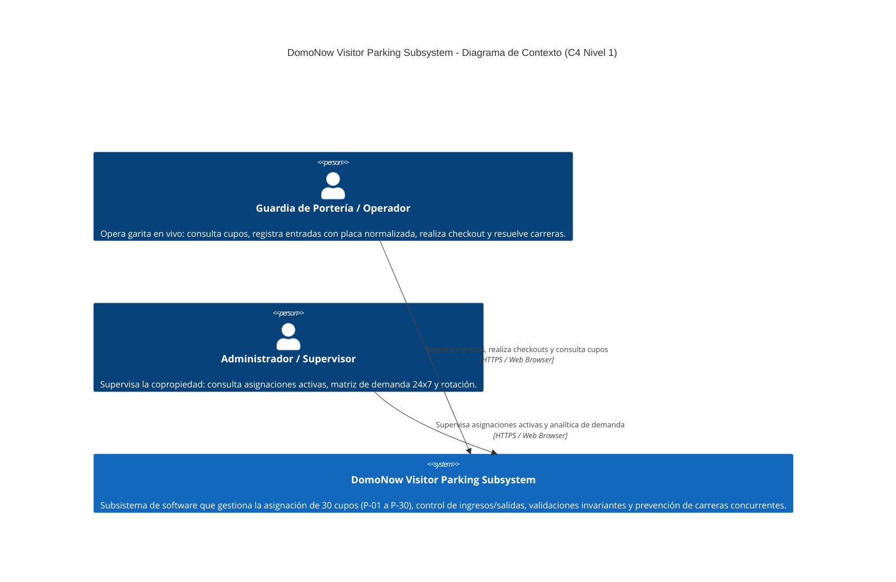
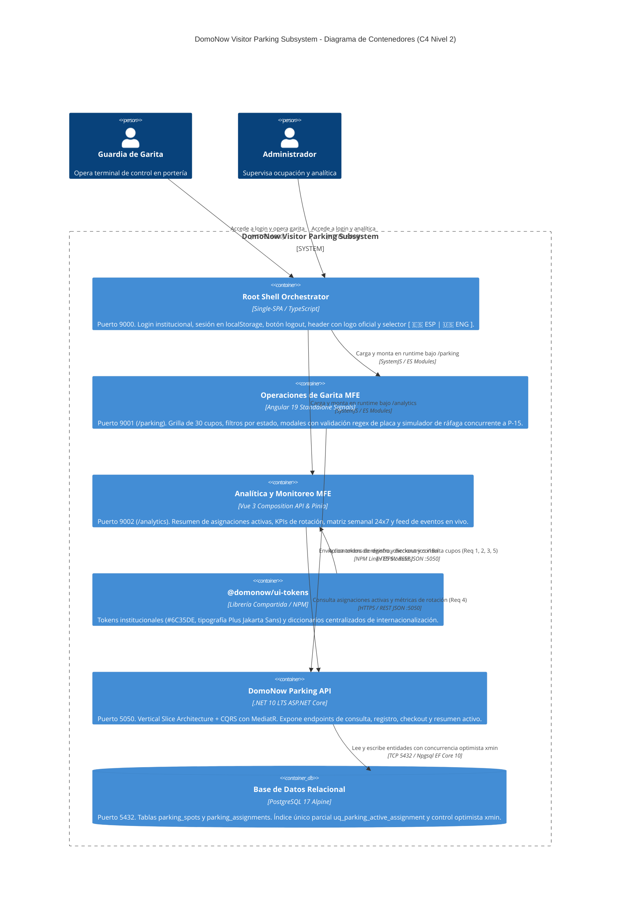
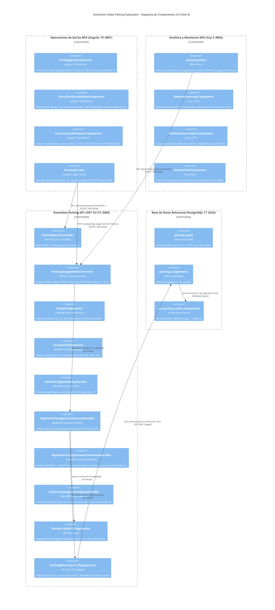

# Documentación Técnica de Arquitectura: DomoNow Visitor Parking Subsystem

Este documento formaliza la arquitectura técnica del subsistema **DomoNow**, modelada bajo el estándar internacional **Modelo C4 (Simon Brown)** en sus tres niveles representativos: **Contexto (Nivel 1)**, **Contenedores (Nivel 2)** y **Componentes (Nivel 3)**.

La arquitectura se encuentra delimitada **estrictamente a los requerimientos normativos y reglas de negocio especificados en [openspec/specs/visitor-parking/spec.md](file:///Users/deals/Documents/GIT/DOMONOW-TEST/collection-domonow/openspec/specs/visitor-parking/spec.md)** y las implementaciones activas en frontend y backend.

---

## 1. Trazabilidad de Requerimientos y Reglas de Negocio (`spec.md`)

Toda la arquitectura implementada y diagramada responde de forma unívoca a los 5 requerimientos normativos del subsistema:

| Identificador | Requerimiento Normativo | Endpoint / Caso de Uso | Reglas de Negocio / Invariantes Soportadas |
| :--- | :--- | :--- | :--- |
| **Req 1** | **Consulta y Filtrado de Cupos** | `GET /api/parking-spots?statusFilter=...` | • Retorna los 30 cupos configurados (`P-01` a `P-30`). • Filtro opcional por estado (`Available`, `Occupied`, `OutOfService`). • Si está ocupado, incluye detalle de la asignación activa (`ActiveAssignmentDto`). |
| **Req 2** | **Registro de Ingreso de Visitantes** | `POST /api/parking-assignments` | • Asigna cupo disponible, registra nombre de visitante y unidad de destino. • Normaliza y valida placa con regex estricto `^[A-Z0-9]{5,8}$` (HTTP 422 si es inválida). • Registra fecha de ingreso en UTC y transiciona cupo a `Occupied` (HTTP 201 Created). • Si el cupo ya está ocupado, rechaza con **HTTP 409 Conflict**. • Si el cupo está `OutOfService`, rechaza con **HTTP 422 Unprocessable Entity**. |
| **Req 3** | **Salida y Reversión de Cupo (Checkout)** | `POST /api/parking-assignments/{id}/checkout` | • Registra `exitTimeUtc` y marca asignación como `Completed`. • **Invariante Temporal:** Verifica que `ExitTime >= EntryTime` (HTTP 400 Bad Request si la salida precede a la entrada). • Retorna HTTP 200 OK con los minutos de estancia calculados. • Restaura automáticamente el cupo asociado a estado `Available`. • Si la asignación no existe, retorna **HTTP 404 Not Found**. |
| **Req 4** | **Resumen de Asignaciones Activas** | `GET /api/parking-assignments/active` | • Expone lista en tiempo real de vehículos actualmente estacionados. • Retorna número de bahía, placa, visitante, unidad y tiempo transcurrido para el operador. |
| **Req 5** | **Control de Alta Concurrencia** | `ConcurrencyRaceControl` | • Garantía transaccional: Ante 10 solicitudes HTTP concurrentes sobre el cupo `P-15`, **exactamente 1 tiene éxito (HTTP 201 Created)** y **exactamente 9 son rechazadas con HTTP 409 Conflict**. • La base de datos garantiza físicamente la unicidad mediante el índice parcial `uq_parking_active_assignment`. |

---

## 2. Justificación Arquitectónica en Lenguaje Natural

### 2.1 ¿Por qué Microfrontends en el Frontend? (Single-SPA, Angular 19 y Vue 3)

La interfaz de usuario no se diseñó como un monolito acoplado, sino como una federación orquestada mediante **Single-SPA**, respondiendo a perfiles y cargas operativas especializadas:

1. **Root Shell Orchestrator (Vite + TypeScript, Puerto 9000):**
   * **Propósito:** Núcleo institucional desacoplado del ciclo de vida de los frameworks hijos.
   * **Capacidades:** Control de acceso mediante pantalla estática de login (`guardia@domonow.io` / `DomoNow2026!`), persistencia de sesión en `localStorage ('domonow_auth_user')`, botón global de cierre de sesión (`#btn-logout`), barra de navegación con logo corporativo oficial (`domonow-logo-320.webp`), selector bilingüe reactivo `[ 🇪🇸 ESP | 🇺🇸 ENG ]` y orquestación dinámica de rutas (`activeWhen`).
   * **Justificación:** Centraliza la autenticación, identidad visual e internacionalización sin obligar a los microfrontends a compartir dependencias de ejecución ni recargar el navegador.

2. **Microfrontend de Operaciones de Garita (Angular 19, Puerto 9001 - `/parking`):**
   * **Propósito:** Consola operativa vehicular de alto tráfico para el guardia en portería.
   * **Capacidades:** Renderizado de la grilla de 30 cupos (`P-01` a `P-30`), filtros por estado (**Req 1**), modales reactivos con sanitización regex de placas (**Req 2**), proceso de checkout (**Req 3**) y simulador de ráfagas concurrentes anti-carreras (**Req 5**).
   * **Justificación:** Angular 19 con **Angular Signals** garantiza reactividad de grano fino, tipado estricto en formularios y minimización de consumo de memoria en hardware de portería.

3. **Microfrontend de Analítica y Monitoreo (Vue 3, Puerto 9002 - `/analytics`):**
   * **Propósito:** Panel analítico de supervisión para el administrador de la copropiedad.
   * **Capacidades:** Resumen de vehículos activos en garita (**Req 4**), matriz semanal de calor 24x7 (Heatmap) de ocupación, curva estimada de demanda horaria y feed en vivo de eventos conectado al bus inter-MFE.
   * **Justificación:** Vue 3 y Pinia proporcionan un Virtual DOM extremadamente ligero y eficiente para renderizar matrices densas de datos sin degradar el rendimiento del navegador.

4. **Librería de Componentes & Tokens (`@domonow/ui-tokens`):**
   * Centraliza la paleta institucional (`#6C35DE`, tipografía *Plus Jakarta Sans*) y los contratos TypeScript compartidos, garantizando coherencia visual inmediata.

---

### 2.2 ¿Por qué CQRS en el Backend?

La separación entre **Commands** (Escritura) y **Queries** (Lectura) resuelve la asimetría de carga del negocio:
* **Escrituras (Commands - Req 2, Req 3 y Req 5):** Operaciones transaccionales que modifican el estado de bahías y asignaciones. Exigen validación exhaustiva de invariantes, serialización y control de concurrencia optimista (`RowVersion` mapeado a `xmin` en PostgreSQL).
* **Lecturas (Queries - Req 1 y Req 4):** Consultas frecuentes de alto rendimiento para actualizar el tablero de garita y el monitor administrativo. Se ejecutan con `AsNoTracking()` sin sobrecarga de tracking de entidades ni bloqueos de escritura.

**Beneficio:** Máxima velocidad de lectura sin interferir con las transacciones críticas de ingreso en la talanquera.

---

### 2.3 ¿Por qué Vertical Slice Architecture?

En contraposición al enfoque de capas horizontales tradicionales (*Controllers -> Services -> Repositories -> Entities*), el backend organiza el código por **casos de uso autónomos**:
* `GetParkingSpotsSlice` (Req 1)
* `RegisterParkingEntrySlice` (Req 2 y Req 5)
* `RegisterParkingCheckoutSlice` (Req 3)
* `GetActiveAssignmentsSlice` (Req 4)

**Beneficio:** Cada rebanada vertical contiene su endpoint, comando o query, validador FluentValidation y handler. Una modificación a las reglas del checkout no afecta al registro de ingresos (*Blast Radius = 0*).

---

## 3. Diagramas Oficiales del Modelo C4

Los diagramas nativos en formato editable de Draw.io (Diagrams.net) están disponibles en el repositorio:
* 📊 **Archivo Maestro Multi-Pestaña:** [c4-architecture.drawio](file:///Users/deals/Documents/GIT/DOMONOW-TEST/collection-domonow/docs/architecture/c4-architecture.drawio)
* 🌐 **Diagrama de Contexto (Nivel 1):** [c4-context.drawio](file:///Users/deals/Documents/GIT/DOMONOW-TEST/collection-domonow/docs/architecture/c4-context.drawio)
* 📦 **Diagrama de Contenedores (Nivel 2):** [c4-containers.drawio](file:///Users/deals/Documents/GIT/DOMONOW-TEST/collection-domonow/docs/architecture/c4-containers.drawio)
* 🧩 **Diagrama de Componentes (Nivel 3):** [c4-components.drawio](file:///Users/deals/Documents/GIT/DOMONOW-TEST/collection-domonow/docs/architecture/c4-components.drawio)

---

### 3.1 C4 - Nivel 1: Diagrama de Contexto del Sistema

Muestra el sistema en su entorno operativo delimitado exclusivamente a los dos actores humanos del dominio:

---

### 3.2 C4 - Nivel 2: Diagrama de Contenedores

Ilustra los contenedores ejecutables, tecnologías seleccionadas, protocolos y almacenamiento persistente:

---

### 3.3 C4 - Nivel 3: Diagrama de Componentes

Detalla los componentes internos de Frontend, los Vertical Slices del Backend y la persistencia en base de datos:

---

## 4. Guía de Uso y Edición de los Archivos Draw.io

Los diagramas C4 están disponibles en formato XML estándar para **Draw.io (Diagrams.net)** con soporte para formas oficiales `mxgraph.c4`:
1. **En la Web:** Abre [https://app.diagrams.net](https://app.diagrams.net) y selecciona `Open Existing Diagram` -> [c4-architecture.drawio](file:///Users/deals/Documents/GIT/DOMONOW-TEST/collection-domonow/docs/architecture/c4-architecture.drawio).
2. **En VS Code / Antigravity:** Con la extensión `hediet.vscode-drawio`, puedes abrir directamente cualquiera de los archivos `.drawio` para visualizarlos o editarlos interactivamente con soporte para pestañas múltiples.
