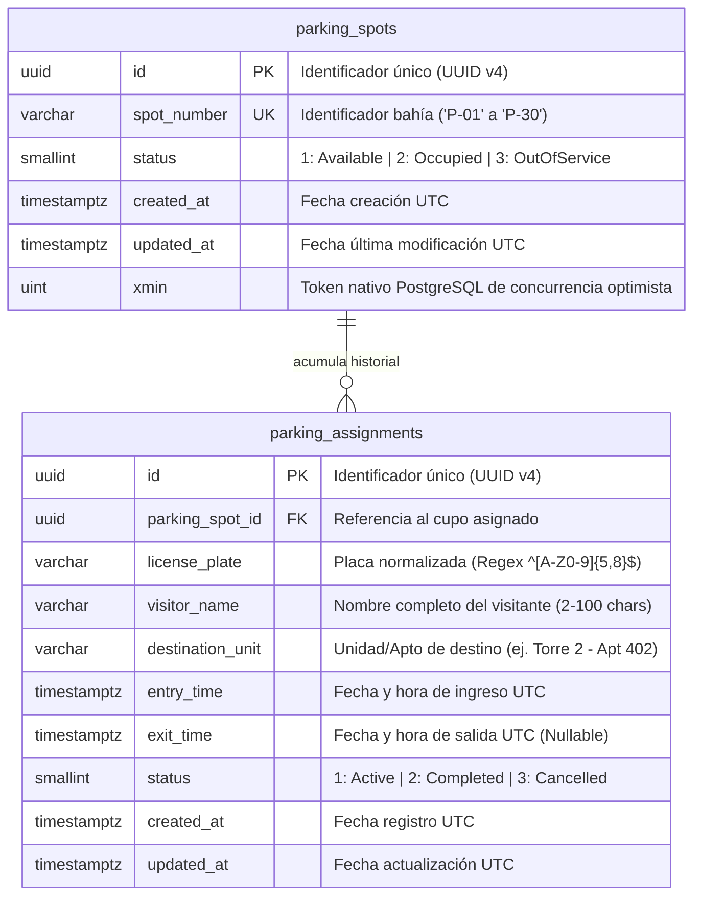

# Justificación del Modelo de Base de Datos y Diagrama ER

**Subsistema:** DomoNow Visitor Parking Management  
**Motor:** PostgreSQL 17 Alpine  
**Especificación DDL de Origen:** [open-spec/06-database-ddl.sql](collection-domonow/open-spec/06-database-ddl.sql)  
**Modelo de Dominio (DDD):** [open-spec/01-domain-model.md](collection-domonow/open-spec/01-domain-model.md)

---

## 1. Diagrama Entidad-Relación (Mermaid ERD)



---

## 2. Relaciones y Mapeo con las Definiciones del Negocio

### 2.1 Cardinalidad: Histórica (1:N) vs Activa (1:1)
* **A nivel relacional histórico (`1:N`):** Un cupo físico (`parking_spots`) tiene muchas asignaciones a lo largo del tiempo para conservar el historial completo de auditoría y analítica.
* **A nivel de negocio activo (`1:1 Invariante Crítica`):** Un cupo solo puede tener **máximo una asignación activa simultánea**.  
  Esto se impone física e indiscutiblemente mediante el **Índice Único Parcial**:
  ```sql
  CREATE UNIQUE INDEX uq_parking_active_assignment 
  ON parking_assignments (parking_spot_id) 
  WHERE status = 1;
  ```
  Si dos transacciones intentan asignar el mismo cupo al mismo milisegundo, PostgreSQL rechaza la segunda con error `23505` (`unique_violation`), garantizando que **nunca ocurra una doble asignación**.

### 2.2 Diccionario de Definiciones y Estados

| Entidad | Campo | Valor | Definición de Negocio | Impacto en el Flujo |
| :--- | :--- | :--- | :--- | :--- |
| `parking_spots` | `status` | **`1`** | **Available (Disponible)** | Listo para recibir un nuevo vehículo visitante. |
| `parking_spots` | `status` | **`2`** | **Occupied (Ocupado)** | Bahía físicamente ocupada por un vehículo. |
| `parking_spots` | `status` | **`3`** | **OutOfService (Mantenimiento)** | Inhabilitado temporalmente. No permite asignaciones. |
| `parking_assignments` | `status` | **`1`** | **Active (Activa)** | Vehículo dentro de las instalaciones. |
| `parking_assignments` | `status` | **`2`** | **Completed (Completada)** | Salida registrada (checkout exitoso). Libera el cupo. |
| `parking_assignments` | `status` | **`3`** | **Cancelled (Cancelada)** | Registro anulado administrativamente. Libera el cupo. |

### 2.3 Sincronización del Ciclo de Vida (State Machine)
1. **Ingreso (Check-in):**  
   `parking_spots.status` pasa a `2 (Occupied)` y se inserta `parking_assignments` con `status = 1 (Active)` y `entry_time = NOW()`.
2. **Salida (Check-out):**  
   `parking_assignments.status` pasa a `2 (Completed)` con `exit_time = NOW()`, calculando minutos de estancia, y `parking_spots.status` se revierte automáticamente a `1 (Available)`.

---

## 3. Justificación de las Decisiones de Diseño del Modelo

### 3.1 Integridad a Nivel de Motor (Zero Trust en Base de Datos)
El modelo no confía ciegamente en que la API o los clientes frontend validen los datos. El motor PostgreSQL impone las restricciones de negocio:
* **Formato de Placa:** `CONSTRAINT chk_assignment_license_plate CHECK (license_plate ~ '^[A-Z0-9]{5,8}$')` garantiza que no entren placas con símbolos o longitudes no estándar.
* **Consistencia Temporal:** `CONSTRAINT chk_assignment_temporal CHECK (exit_time IS NULL OR exit_time >= entry_time)` impide físicamente registrar salidas anteriores al ingreso.
* **Integridad Referencial Estricta:** `ON DELETE RESTRICT` evita que se borre un cupo físico si tiene historial de visitas, protegiendo la trazabilidad jurídica y contable.

### 3.2 Concurrencia Optimista Nivel Enterprise con `xmin`
En lugar de agregar columnas artificiales de control de versión o bloqueos pesados de fila (`SELECT ... FOR UPDATE`), EF Core mapea la columna de sistema nativa de PostgreSQL **`xmin`** en `parking_spots`. Si dos operadores intentan modificar el mismo cupo a la vez, el motor detecta el cambio de transacción y eleva un conflicto sin impacto en rendimiento.

### 3.3 Tipos de Datos y Rendimiento
* **`UUID v4`:** Identificadores opacos y distribuidos que previenen ataques de enumeración (Insecure Direct Object Reference - IDOR).
* **`SMALLINT` (2 bytes):** Para los enums de estado (`status`), reduciendo drásticamente el tamaño del índice parcial y las páginas en memoria caché.
* **`TIMESTAMPTZ`:** Almacenamiento obligatorio con zona horaria UTC para evitar desalineaciones en auditorías o cambios de huso horario.
* **Índices Estratégicos:** Índices específicos sobre `status`, `license_plate` y `entry_time` para acelerar las consultas de garita y los reportes de ocupación.
